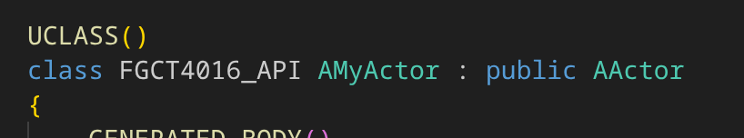
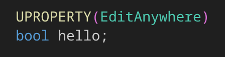
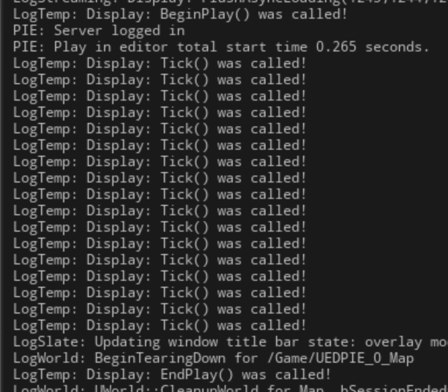
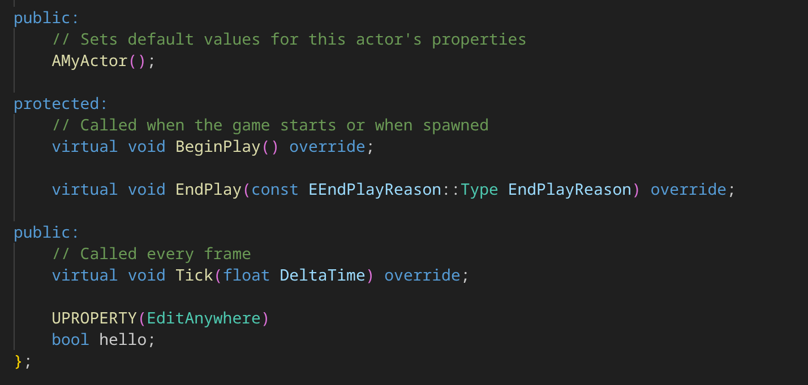
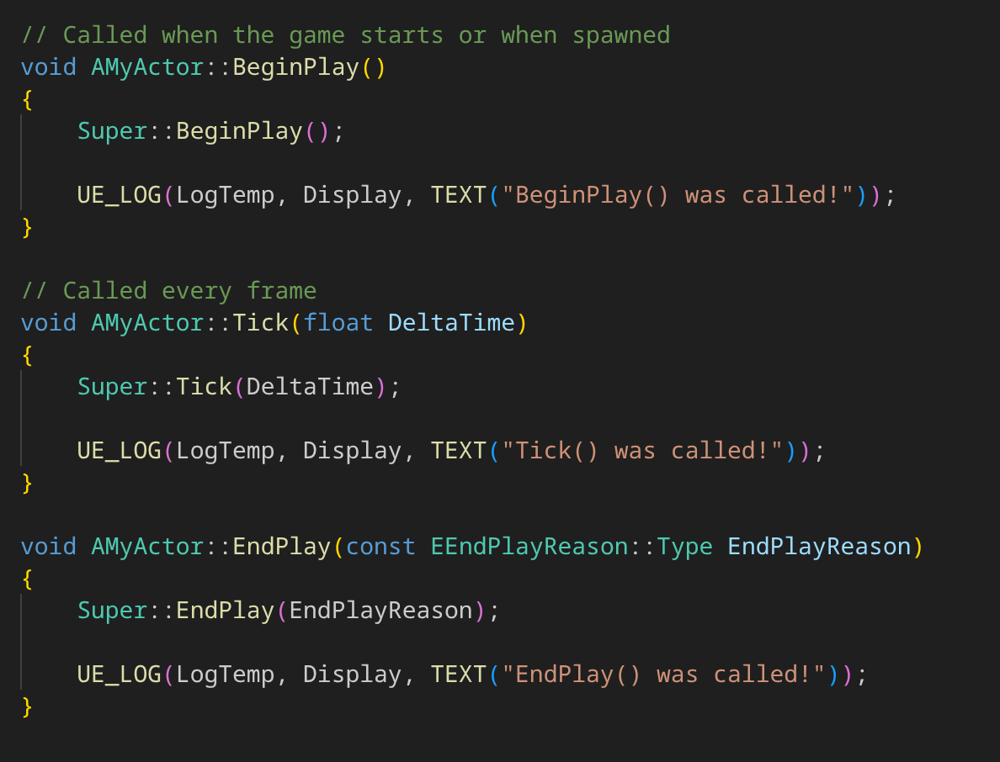

# FGCT4016 Gameplay Design and Programming
 
## Task 1: Environment Verification Task
Classes in Unreal are all derived from `UOBJECT`, and can be tagged with the `UCLASS` macro in order to make that class visible and interactable within other parts of the editor, such as blueprints.

Similarly, the `UFUNCTION` and `UPROPERTY` macros can be used to tag functions and variables respectively for the same purpose.

## Task 2: Actor Lifecycle Logging

